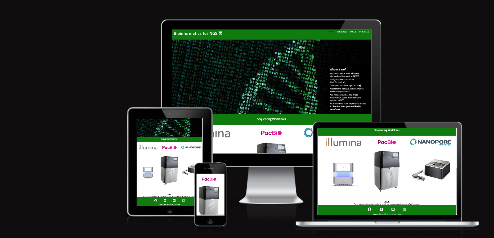
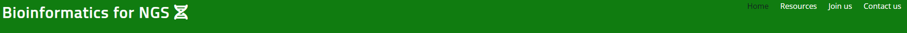
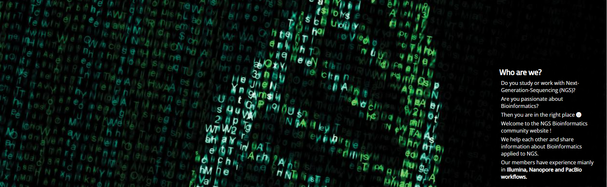
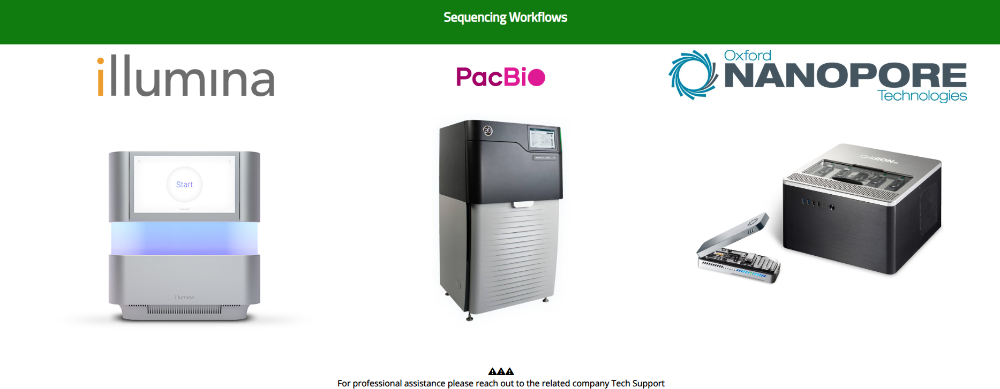
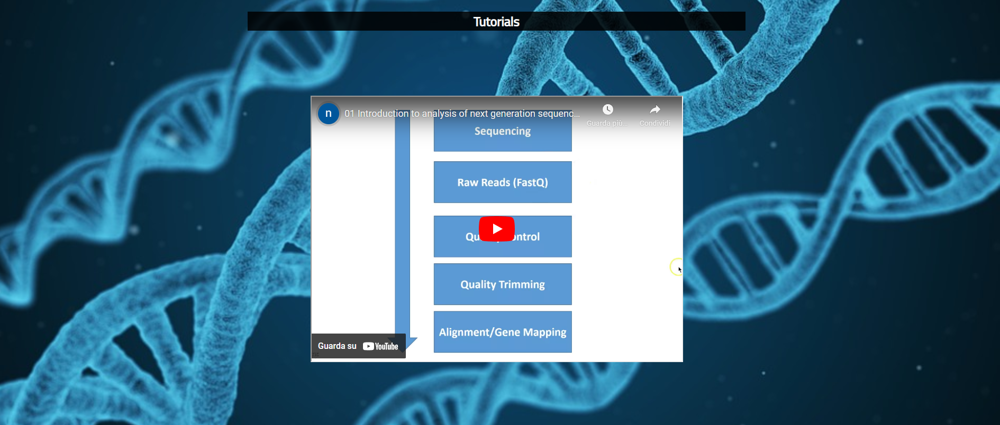
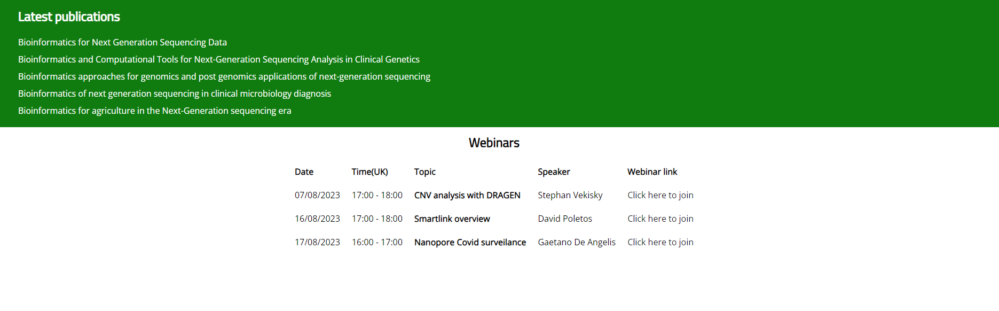
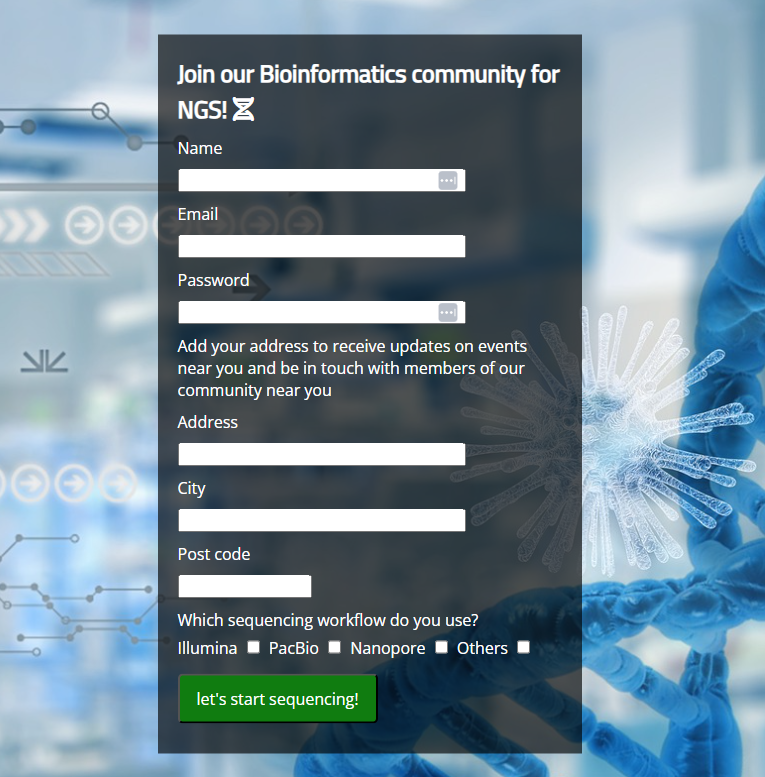
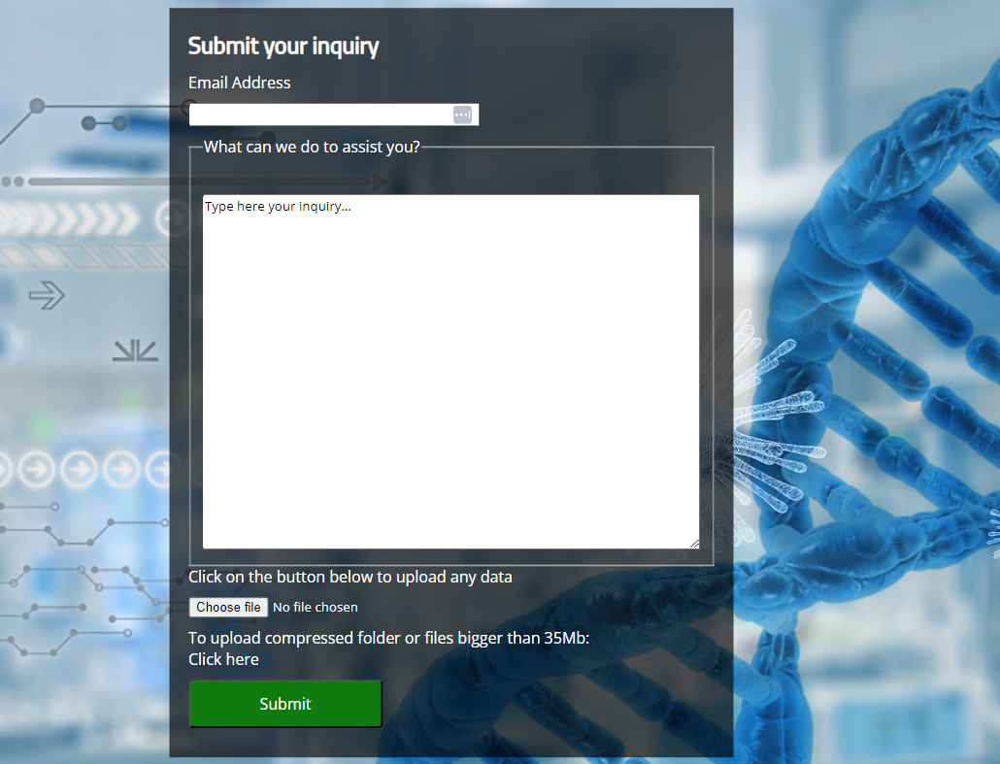
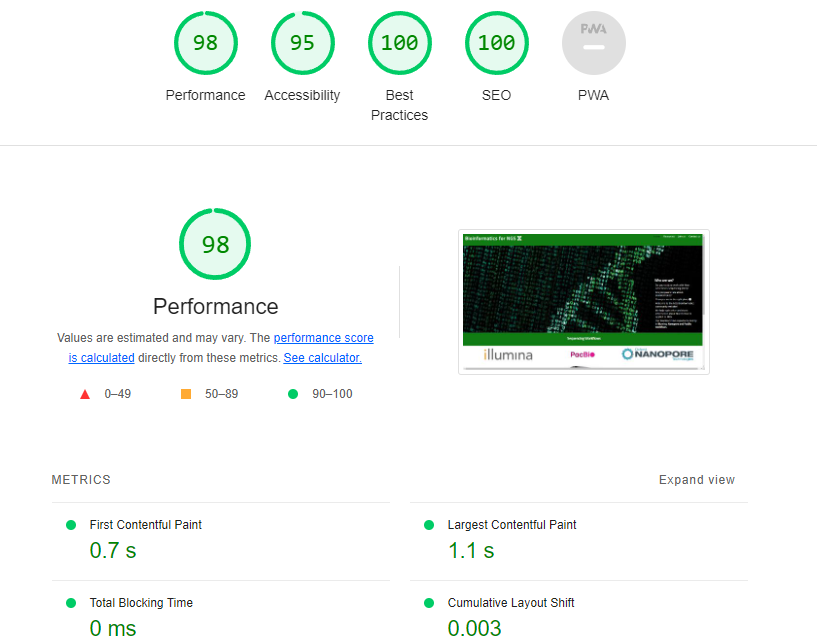

# Bioinformatics community for Next Generation Sequencing(NGS)

Welcome,

The bioinformatics community website is a landing page for everyone working in the bioinformatics applied to Next-Generation-Sequencing.
The goal is to connect to the other community members in your area, and assist in bioinformatics challenges.
On the Website you will also find **tutorials**, latest **scientific papers**, and online **webinars**.
If you want our community to assist you with a specific issue, you can fill the **contact us** form, and upload your data.

   
_____________________________
## Features
- ### Navigation 
  - At the top left corner of the page there is the website title linking to the home page.
  - The ramaining navigation links show up to the right: Home,Resources, Join us, Contact us.
  - The white color of the font contrasts with the green background.
  - The navigation describes the name of the website and make easy to the user to navigate trough the different sections.
  - The color of the font in the navigation bar changes on the basis of where the user is.
  - On small screens the links move beneath the title.
  ________________________________________________________

  

- ### Footer
    - The footer shows the copyright.
    - Facebook, Twitter, Youtube and Instagram socials are linked.
    - Aria-label is present to improve accessibility.
    - Links open in a new page.
_______________________________________________________________
  
- ### Home
    - Includes a text-box describing in a few words the purpose of the website.
    - Contains an hero image representing a DNA double helix, it also includes a scrolling down animation representing code moving in a terminal.
    - Contains a list of the principal sequencing company. The community has experience in working on each of them.
    - An example instrument is shown for each company.
    - A disclaimer explains to the user that the website is not a Tech Support website and the latter should be contacted for professional assistance.
    - In media query the company logos and instrument show up as a column, and the logo instrument order is mantained. 
    __________________________________________________________
   
   

- ### Resources
     - Includes a video tutorial section about bioinformatic basics for NGS.
     - Includes the list of the latest publications.
     - The user can click on the publication and it will open in a new link.
     - The link font is white to contrast to the green background.
     - When the user clicks on the link, the font color changes to black to increase accessibility.
     - The webinars section includes a table showing date, topic, speaker and zoom link to the webinar.
     - On small screens the tables can be scrolled to access all info.
     _________________________________________________________
    
    

- ### Join us
     - Contains the form to join the bioinformatic NGS community
     - Name, e-mail and password are required info.
     - Address info are optional, if added the user will be in touch with other members and events near him.
     - The user can select which sequencing workflow/workflows he is using.
     - The submit button changes color when the user selects it.
     - Form inputs are sent trough POST method to API server.
     __________________________________________________________
     

- ### Contact us
     - Contains a form to submit an inquiry.
     - The user has to add the e-mail address.
     - In the form a text suggesting were to write the inquiry is shown.
     - User can upload files up to 35MB by selecting the choose file button.
     - For files bigger than 35MB or compressed folder the customer can select the click here button and upload files to Kiteworks.
    ____________________________________________
     
__________________________________________________________
## Testing
   - Pages have been tested in the browser Chrome, Edge and Firefox.
   - The project adapts to big and small screen displays.
   - All links have been tested and are functional.
   - All forms filed have been tested and work as expected.
__________________________________________________
## Validator Testing
   -  HTML
        - No error was returned when submitted to the W3C validator.
   - CSS 
        - No error was returned when submitted to the Jigsaw validator.
   - Accessibility
        - Colors and fonts are accessible and easy to read when parsed trough lighthouse in devtools.
     
__________________________________________________
## Deployment
   - The website was deployed to GitHub pages.The website has been deployes as follow:
     1. Select Setting on the repository menu
     2. Select Pages in the menu on the right
     3. Select Deploy from a branch
     4. Select main branch then click on save
Live link [Bioinformatics for NGS](https://angelogaeta1990.github.io/bifxngs_community/)
 _______________________________________________________  
 ## Credits
  - Media
    Images and video have been taken from the following websites:
    - [Pixabay](https://pixabay.com/)
    - [Illumina](https://www.illumina.com/)
    - [PacBio](https://www.pacb.com/)
    - [Nanopore](https://nanoporetech.com/)
    - [YouTube](https://www.youtube.com/embed/GWO1UddLVcM)

       

